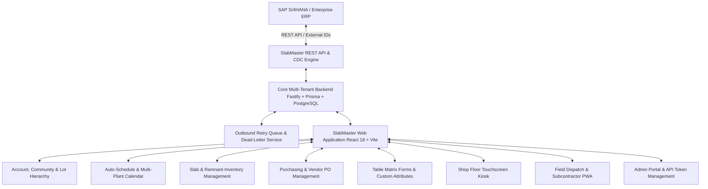

# SlabMaster™ Enterprise Platform
# Executive Summary & Strategic Overview

**Version:** v1.0.0  
**Target Industry:** Stone Fabrication, Quartz Manufacturing & High-Volume Countertop Installation  
**Deployment Surface:** Cloud Multi-Tenant SaaS (Azure Static Web Apps + Container Apps) & Mobile Offline PWA  
**Updated:** September 2026  

---

## 1. Executive Summary

**SlabMaster™** is a modern, enterprise-grade cloud fabrication and field execution platform purpose-built for stone fabricators, quartz manufacturers, commercial millwork contractors, and high-volume residential countertop installers. 

Historically, the stone fabrication industry has been constrained by legacy client-server tools such as Moraware Systemize and CounterGo—technologies architected decades ago with antiquated desktop-bound UIs, brittle SOAP/.NET APIs, lack of native mobile capability, absence of true ERP integration, and no offline field support.

SlabMaster bridges the critical operational divide between corporate ERP systems (e.g., SAP S/4HANA, Microsoft Dynamics, NetSuite) and shop floor/field reality. It delivers an end-to-end operational platform spanning:
1. **Three-Tier Account/Community/Lot Hierarchy** tailored for national homebuilders and commercial developments.
2. **Automated Lead-Time Scheduling Engine** supporting plant-specific working days, holiday blackouts, and truck capacity limits.
3. **Live Slab & Remnant Inventory Control** with barcode/QR tracking, bin locations, lot allocations, and defect logging.
4. **Direct Materials Purchasing & Receiving** with automated PO generation, vendor tracking, and inventory reconciliation.
5. **Shop Floor Kiosk PWA** for touchscreen sawjet, CNC, and polish station tracking with one-tap milestone advances.
6. **Mobile Field Dispatch & Subcontractor Portal** with offline capability, GPS routing, digital photo uploads, and customer sign-off capture.
7. **Custom Table Matrix Forms & EAV Attribute Engine** allowing fabricators to capture arbitrary multi-row specifications without code changes.
8. **Modern RESTful ERP Two-Way Sync** featuring external ID resolution (`externalId`), Change Data Capture (CDC), and an automated Outbound Retry Queue with exponential backoff and dead-letter recovery.

---

## 2. Market Problem vs. The SlabMaster Solution

| Operational Challenge | Legacy Solutions (Moraware / Spreadsheets) | The SlabMaster Advantage |
|---|---|---|
| **ERP Synchronization** | Brittle SOAP APIs, no two-way sync, requires manual re-keying of orders and milestones. | **Modern RESTful JSON API** with bi-directional synchronization, external ID routing (`SAP-ORD-xxx`), and CDC polling feed. |
| **Network & Service Resilience** | Failed API calls are lost or crash batch imports; no retry queue. | **Progressive Backoff Ladder** (`0s ➔ 1m ➔ 5m ➔ 15m ➔ 1h ➔ Dead-Letter`) with Admin Portal manual recovery controls. |
| **Builder / Lot Hierarchy** | Flat job lists or clumsy parent-child tagging; cannot model national homebuilder subdivisions. | **Native 3-Tier Hierarchy:** Builder Account ➔ Community / Subdivision ➔ Lot / Unit Phase with inherited attributes. |
| **Field Tech Mobility** | Clunky desktop web pages requiring constant cellular connectivity; unusable in basement/concrete dead zones. | **Offline-First PWA:** Full offline caching via IndexedDB & Service Workers; automatic sync upon reconnection. |
| **Shop Floor Visibility** | Paper cut tickets and physical job folders subject to loss, coffee stains, and fabrication errors. | **Touchscreen Kiosk View:** High-contrast, glove-friendly station barcodes, instant cut list inspection, and real-time station advancing. |
| **Remnant & Slab Utilization** | High scrap rates, lost remnant slabs, and unverified inventory counts. | **Granular Slab Lifecycle:** Full remnant tracking (`Original ➔ In-Cut ➔ Remnant ➔ Consumed`), QR bin labels, and lot allocations. |
| **Flexible Data Collection** | Rigid fixed schema requiring expensive vendor customizations. | **Visual Form Matrix Builder & Dynamic Custom Fields** supporting multi-row tabular matrices, signature pads, and photo capture. |

---

## 3. Core Architectural Modules

### Module Breakdown
- **Tier 1: Enterprise Integration:** High-throughput REST API, SAP Developer Documentation Pack, and downloadable Postman v2.1 collection.
- **Tier 2: Manufacturing & Logistics:** Shop floor station trackers, sawjet cut lists, barcode scanners, and inventory replenishment.
- **Tier 3: Commercial & Residential Scheduling:** 14-day visual matrix, lead-time offsets, plant operating hours, and crew balancing.
- **Tier 4: Field Operations:** Mobile PWA, digital customer sign-offs, photo attachments, and offline form execution.
- **Tier 5: Platform Governance:** Microsoft Entra ID SSO, multi-plant scoping, granular RBAC, and full audit trails.

---

## 4. Key Business Value & Strategic ROI

1. **Elimination of Dry-Run Trips (Est. Savings: $450 - $750 per avoided trip):**
   Automated readiness checks and real-time builder milestone alignment prevent installation crews from arriving at unready job sites.
2. **Zero Double-Entry Overhead:**
   Direct bi-directional synchronization with SAP/ERP eliminates manual order entry, reducing clerical overhead by 80% and removing human transcription errors.
3. **Optimized Stone Yield & Remnant Monetization:**
   Systematic remnant tracking and bin location tagging allow fabricators to repurpose offcuts for vanities and powder rooms instead of discarding them as scrap.
4. **Rapid Contractor & Crew Onboarding:**
   Self-service Microsoft Entra ID invitations and scoped 1099 contractor portals allow third-party installers to be onboarded in minutes without risking proprietary pricing leaks.
5. **Real-Time Job Profitability & Traceability:**
   Every slab, purchase order, cut ticket, and field modification is permanently linked to the specific Lot and Job, ensuring full financial traceability.

---

## 5. Summary of System Maturity & Quality Metrics

- **Application Version:** `v1.0.0` (production-ready).
- **Automated Test Coverage:** 39 tests across 9 comprehensive test files covering inventory, purchasing, custom forms, shop floor, table matrices, help documentation, and API retry queues (100% pass rate).
- **Build Quality:** Strict TypeScript typing (`tsc`) with zero errors across frontend and backend.
- **CI/CD Integration:** Azure Static Web Apps native deployment with automated build-time test gates.
