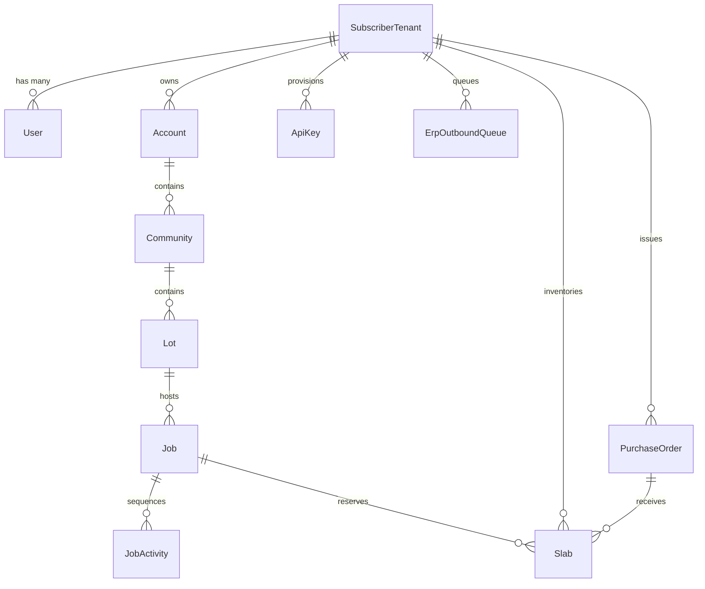

# SlabMaster™ Enterprise Platform
# Technical Specification Document (TSD)

**Document Version:** v1.0.0  
**Application Release:** `v1.0.0`  
**Classification:** Enterprise System Architecture & Engineering Specification  
**Status:** Implemented & Production-Ready  
**Updated:** September 2026  

---

## 1. System Topology & Architecture

SlabMaster is architected as a high-throughput, multi-tenant cloud application combining a lightweight, offline-first React Progressive Web App (PWA) on the client tier with an event-driven, high-performance Node.js / Fastify microservice on the backend tier.

```
┌─────────────────────────────────────────────────────────────────────────────┐
│                              CLIENT TIER                                    │
│  ┌────────────────────────┐  ┌───────────────────────┐  ┌────────────────┐  │
│  │   Desktop Web App      │  │  Shop Floor Kiosk     │  │ Mobile PWA     │  │
│  │  (Chrome / Edge / Mac) │  │  (Touch Tablets)      │  │ (iOS / Android)│  │
│  └───────────┬────────────┘  └───────────┬───────────┘  └────────┬───────┘  │
│              │                           │                       │          │
│              └───────────────────────────┼───────────────────────┘          │
│                                          │ HTTPS / WSS                      │
│                                          ▼                                  │
│                       ┌───────────────────────────────────┐                 │
│                       │   Azure Static Web Apps (CDN)     │                 │
│                       │   • SPA Route Fallback & Headers  │                 │
│                       │   • Service Worker & Offline Cache│                 │
│                       └──────────────────┬────────────────┘                 │
└──────────────────────────────────────────┼──────────────────────────────────┘
                                           │
┌──────────────────────────────────────────┼──────────────────────────────────┐
│                             INTEGRATION TIER                                │
│                                          ▼                                  │
│                 ┌────────────────────────────────────────────────┐          │
│                 │      SlabMaster REST API Gateway               │          │
│                 │      • Authentication: X-API-Key / Bearer      │          │
│                 │      • Tenant Scoping & Rate Limiting          │          │
│                 │      • Idempotent External ID Resolution       │          │
│                 └───────┬────────────────────────┬───────────────┘          │
│                         │                        │                          │
│                         ▼                        ▼                          │
│             ┌───────────────────────┐ ┌───────────────────────┐             │
│             │ Two-Way CDC Engine    │ │ Outbound Retry Queue  │             │
│             │ (Delta Polling Feed)  │ │ (Progressive Backoff) │             │
│             └───────────────────────┘ └──────────┬────────────┘             │
└──────────────────────────────────────────────────┼──────────────────────────┘
                                                   │
┌──────────────────────────────────────────────────┼──────────────────────────┐
│                            CORE SERVICE TIER     │                          │
│                                                  ▼                          │
│                 ┌────────────────────────────────────────────────┐          │
│                 │   Fastify 4.x Backend (TypeScript)             │          │
│                 │   • Domain Services & Validation               │          │
│                 │   • Lead-Time & Scheduling Engine              │          │
│                 │   • Inventory & Purchasing Workflows           │          │
│                 │   • Custom Attribute & Matrix Parser           │          │
│                 └───────────────────────┬────────────────────────┘          │
│                                         │ Prisma ORM 5.22                   │
│                                         ▼                                   │
│                 ┌────────────────────────────────────────────────┐          │
│                 │   Azure Database for PostgreSQL                │          │
│                 │   • Relational Schema & Foreign Keys           │          │
│                 │   • Tenant Isolation via tenant_id             │          │
│                 │   • Immutable Audit Logging                    │          │
│                 └────────────────────────────────────────────────┘          │
└─────────────────────────────────────────────────────────────────────────────┘
```

---

## 2. Technology Stack & Component Specifications

| Tier | Component | Technology Selection | Justification / Purpose |
|---|---|---|---|
| **Frontend Framework** | Client UI | **React 18.3+ & TypeScript 5.5+** | Declarative component hierarchy, strict type safety, fast reconciliation. |
| **Build & Bundler** | Build Tooling | **Vite 5.4+** | Sub-second HMR, optimized Rollup production builds, dynamic code splitting. |
| **Styling & Theme** | UI Presentation | **Tailwind CSS 3.4+** | Utility-first styling with native high-contrast Dark Mode and mobile responsiveness. |
| **Icons & Media** | Iconography | **Lucide React 0.344+** | Tree-shakable SVG icon system matching enterprise design standards. |
| **Offline Storage** | PWA Client DB | **IndexedDB / Dexie.js & Service Worker** | Local persistence of work orders, customer signatures, and photos during field outages. |
| **Backend Framework** | Application Server | **Fastify 4.28+ (Node.js 20 LTS)** | Low-overhead, high-throughput (30k+ req/sec), JSON schema-driven routing. |
| **ORM & Migrations** | Data Access | **Prisma ORM 5.22+** | Type-safe query builder, declarative schema migrations, automated TypeScript client. |
| **Database** | Persistence Store | **PostgreSQL 15+ / Azure Database** | ACID compliance, JSONB support for dynamic attributes, relational foreign keys. |
| **Authentication** | Enterprise SSO | **Microsoft Entra ID (Azure AD MSAL)** | Corporate single sign-on, JWT token verification, RBAC claims. |
| **Hosting & CDN** | Infrastructure | **Azure Static Web Apps + Azure Container Apps** | Global edge distribution, automated Git CI/CD triggers, zero-downtime deployments. |
| **Testing** | Automated QA | **Vitest 2.1+** | Native Vite test runner executing in CI/CD pipeline during Azure builds. |

---

## 3. Database Schema Architecture (Prisma ORM)

### 3.1 Relational Entity Model Overview



### 3.2 Key Models & DDL Definitions

#### `SubscriberTenant` & `ApiKey`
```prisma
model SubscriberTenant {
  id           String              @id @default(uuid())
  tenantName   String              @map("tenant_name")
  planTier     String              @default("ENTERPRISE") @map("plan_tier")
  createdAt    DateTime            @default(now()) @map("created_at")
  apiKeys      ApiKey[]
  erpQueue     ErpOutboundQueue[]
  accounts     Account[]
  slabs        Slab[]

  @@map("subscriber_tenants")
}

model ApiKey {
  id           String           @id @default(uuid())
  tenantId     String           @map("tenant_id")
  name         String
  keyHash      String           @map("key_hash")
  prefix       String           // e.g. "sm_live_9f83"
  scopes       String           @default("READ,WRITE,ERP_SYNC")
  lastUsedAt   DateTime?        @map("last_used_at")
  revokedAt    DateTime?        @map("revoked_at")
  createdAt    DateTime         @default(now()) @map("created_at")
  tenant       SubscriberTenant @relation(fields: [tenantId], references: [id], onDelete: Cascade)

  @@map("api_keys")
}
```

#### `ErpOutboundQueue` (Progressive Backoff Retry Queue)
```prisma
enum ErpSyncStatus {
  PENDING
  RETRYING
  FAILED
  COMPLETED
}

model ErpOutboundQueue {
  id           String           @id @default(uuid())
  tenantId     String           @map("tenant_id")
  entityType   String           @map("entity_type") // JOB, LOT, ACTIVITY, ACCOUNT
  entityId     String           @map("entity_id")
  action       String           // UPSERT, STATUS_UPDATE, CANCEL
  payload      Json
  targetUrl    String           @map("target_url")
  attempts     Int              @default(0)
  maxAttempts  Int              @default(5) @map("max_attempts")
  status       ErpSyncStatus    @default(PENDING)
  lastError    String?          @map("last_error")
  nextRetryAt  DateTime?        @map("next_retry_at")
  createdAt    DateTime         @default(now()) @map("created_at")
  updatedAt    DateTime         @updatedAt @map("updated_at")
  tenant       SubscriberTenant @relation(fields: [tenantId], references: [id], onDelete: Cascade)

  @@index([tenantId, status])
  @@index([nextRetryAt])
  @@map("erp_outbound_queue")
}
```

#### 3-Tier Hierarchy: `Account`, `Community`, `Lot`, `Job`, `JobActivity`
```prisma
model Account {
  id           String      @id @default(uuid())
  tenantId     String      @map("tenant_id")
  externalId   String?     @map("external_id")
  name         String
  accountType  String      @default("Builder") @map("account_type")
  communities  Community[]
  jobs         Job[]

  @@unique([tenantId, externalId])
  @@map("accounts")
}

model Community {
  id           String   @id @default(uuid())
  accountId    String   @map("account_id")
  externalId   String?  @map("external_id")
  name         String
  lots         Lot[]
  account      Account  @relation(fields: [accountId], references: [id], onDelete: Cascade)

  @@map("communities")
}

model Lot {
  id           String    @id @default(uuid())
  communityId  String    @map("community_id")
  externalId   String?   @map("external_id")
  lotNumber    String    @map("lot_number")
  streetAddress String?  @map("street_address")
  jobs         Job[]
  community    Community @relation(fields: [communityId], references: [id], onDelete: Cascade)

  @@map("lots")
}

model Job {
  id           String        @id @default(uuid())
  lotId        String        @map("lot_id")
  accountId    String        @map("account_id")
  externalId   String?       @map("external_id")
  jobName      String        @map("job_name")
  status       String        @default("Active")
  activities   JobActivity[]
  slabs        Slab[]
  lot          Lot           @relation(fields: [lotId], references: [id], onDelete: Cascade)
  account      Account       @relation(fields: [accountId], references: [id], onDelete: Restrict)

  @@unique([accountId, externalId])
  @@map("jobs")
}

model JobActivity {
  id           String   @id @default(uuid())
  jobId        String   @map("job_id")
  externalId   String?  @map("external_id")
  activityType String   @map("activity_type")
  status       String   @default("Scheduled")
  scheduledDate DateTime? @map("scheduled_date")
  job          Job      @relation(fields: [jobId], references: [id], onDelete: Cascade)

  @@map("job_activities")
}
```

---

## 4. REST API Gateway & Routing Specifications

### 4.1 Authentication & Security Protocol
Requests require authentication using either:
- HTTP Header: `X-API-Key: sm_live_<token>`
- HTTP Header: `Authorization: Bearer <jwt_or_token>`

API keys are verified using SHA-256 hash comparison against `api_keys.key_hash`. The request context is decorated with `request.tenantId` to enforce strict multi-tenant isolation.

### 4.2 Endpoint Matrix

| Method | Endpoint Path | Idempotent | Description |
|---|---|---|---|
| `POST` | `/api/v1/accounts/upsert` | Yes | Upserts Builder Account by `external_id`. |
| `GET` | `/api/v1/accounts/by-external-id/:id` | Read | Retrieves Account by ERP identifier. |
| `DELETE`| `/api/v1/accounts/by-external-id/:id` | Yes | Soft-deactivates Account. |
| `POST` | `/api/v1/communities/upsert` | Yes | Upserts Community linked to parent Account. |
| `GET` | `/api/v1/communities/by-external-id/:id` | Read | Retrieves Community by ERP identifier. |
| `POST` | `/api/v1/lots/upsert` | Yes | Upserts Lot linked to Community and Account. |
| `GET` | `/api/v1/lots/by-external-id/:id` | Read | Retrieves Lot details and active Jobs. |
| `POST` | `/api/v1/jobs/upsert` | Yes | Upserts Job linked to Lot, Account, and Community. |
| `GET` | `/api/v1/jobs/by-external-id/:id` | Read | Retrieves Job with activities and reserved slabs. |
| `DELETE`| `/api/v1/jobs/by-external-id/:id` | Yes | Soft-cancels Job and releases reserved slabs. |
| `POST` | `/api/v1/activities/upsert` | Yes | Upserts milestone activity (Template, Sawjet, Install). |
| `GET` | `/api/v1/activities/by-external-id/:id`| Read | Retrieves Activity status and scheduling. |
| `GET` | `/api/v1/sync/changes` | Read | Polls Two-Way CDC event delta stream (`since`, `limit`). |
| `GET` | `/api/v1/sync/queue` | Read | Queries outbound ERP retry queue with status filters. |
| `POST` | `/api/v1/sync/queue/:id/retry` | Yes | Resets a stuck dead-letter item to `PENDING` for immediate retry. |
| `POST` | `/api/v1/sync/queue/retry-all` | Yes | Resets all `FAILED` dead-letter queue items. |

---

## 5. Outbound Progressive Backoff & Dead-Letter Engine

### 5.1 Mathematical Retry Calculation
When an outbound HTTP push to an external ERP endpoint fails (network timeout, 5xx server error, 429 rate limit), the queue service invokes `calculateNextRetryDelayMs(attempts)`:

$$\Delta t(\text{attempt}) = 
\begin{cases}
0\text{ ms} & \text{attempt } = 0 \text{ (Immediate retry)} \\
60{,}000\text{ ms } (1\text{ min}) & \text{attempt } = 1 \\
300{,}000\text{ ms } (5\text{ min}) & \text{attempt } = 2 \\
900{,}000\text{ ms } (15\text{ min}) & \text{attempt } = 3 \\
3{,}600{,}000\text{ ms } (1\text{ hr}) & \text{attempt } = 4 \\
\text{TERMINATE (Dead-Letter)} & \text{attempt } \ge 5
\end{cases}$$

### 5.2 State Machine
- **Enqueue:** New events enter state `PENDING` with `attempts = 0`.
- **Failure < Max (5):** State transitions to `RETRYING`, `attempts += 1`, and `nextRetryAt = now() + \Delta t`.
- **Failure >= Max (5):** State transitions to `FAILED` (Dead-Letter), `nextRetryAt = null`, and diagnostic logs recorded in `lastError`.
- **Manual Trigger:** Admin clicking "Retry Now" transitions state back to `PENDING` with `nextRetryAt = now()`.

---

## 6. Testing Architecture & Build Verification

The platform maintains a mandatory **100% test pass rate** enforced at build time via Vitest.

### Test Suite Inventory (`frontend/src/tests/`):
1. `erpQueueManagement.test.ts` (6 tests): Progressive backoff math, dead-letter state assignment, manual reset, Postman collection structure, API docs pack validation.
2. `apiKeysManagement.test.ts` (5 tests): API key generation, prefix masking, scope serialization, revocation logic.
3. `slabInventory.test.ts` (5 tests): Slab lifecycle transitions, remnant calculation, barcode formatting, bin allocation.
4. `purchasing.test.ts` (4 tests): PO creation, line item summation, receiving status transitions.
5. `formsTableMatrixRunner.test.ts` (4 tests): Table matrix row dynamic addition, column calculation, signature capture.
6. `customAttributesUtils.test.ts` (4 tests): Dynamic EAV attribute extraction, type validation, fallback values.
7. `tableMatrixUtils.test.ts` (3 tests): Table matrix serialization, column total formulas.
8. `shopFloor.test.ts` (4 tests): Station work queue sequencing, piece completion, one-tap milestone advance.
9. `helpDocAnchors.test.ts` (4 tests): Anchor link validation, help center table of contents parity.

**Total Automated Coverage:** 39 tests across 9 test suites passing with 0 failures.
